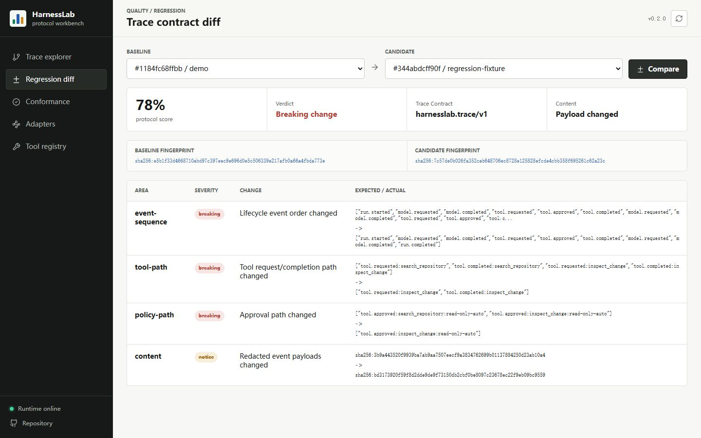
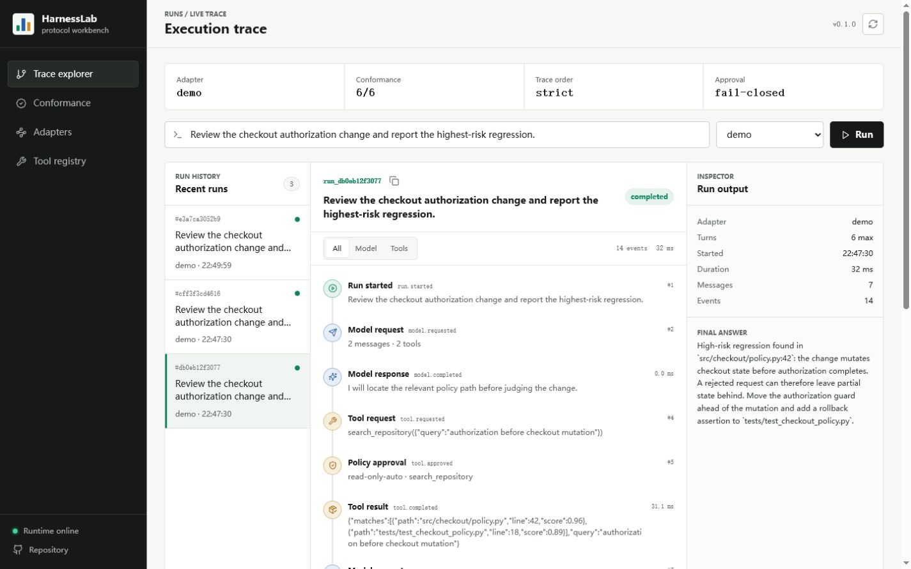
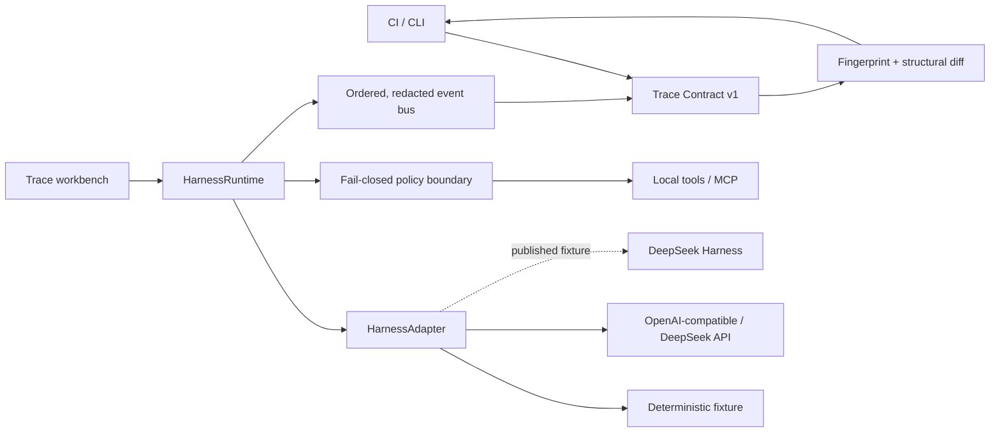

# HarnessLab

**Record, diff, and gate agent harness behavior as an executable trace contract.**

[](https://github.com/Linxiushen/harnesslab/actions/workflows/ci.yml)
[](https://github.com/Linxiushen/harnesslab/releases)
[](https://www.python.org/)
[](LICENSE)
[](https://github.com/Linxiushen/harnesslab/stargazers)

[Live demo](https://linxiushen.github.io/harnesslab/) · [Quickstart](#30-second-quickstart) · [Trace Contract](docs/TRACE_CONTRACT.md) ·
[CLI](#cli) · [DeepSeek readiness](#deepseek-harness-readiness) ·
[中文说明](docs/README.zh-CN.md)

Agent runs can look correct while their control flow quietly regresses: a tool executes before
approval, a call no longer receives a correlated result, or a terminal event appears twice.
HarnessLab turns that behavior into a portable `harnesslab.trace/v1` artifact with stable
fingerprints, structural diffs, and CI exit codes.

> [!IMPORTANT]
> DeepSeek Harness has not published a protocol at the time of writing. HarnessLab does not claim
> official or preview compatibility. The discovery boundary is isolated so integration can be
> implemented against published fixtures instead of a guessed wire format.



## 30-second quickstart

The reference adapter is deterministic, offline, and needs no model key.
The workbench also seeds a clearly labeled regression fixture so the diff surface demonstrates a
real breaking tool-path change immediately.

```bash
git clone https://github.com/Linxiushen/harnesslab.git
cd harnesslab
python -m venv .venv
```

Windows:

```powershell
.venv\Scripts\pip install -e ".[dev]"
.venv\Scripts\harnesslab snapshot "Review the checkout authorization change" -o baseline.trace.json
.venv\Scripts\harnesslab verify baseline.trace.json
.venv\Scripts\harnesslab serve
```

macOS and Linux:

```bash
.venv/bin/pip install -e ".[dev]"
.venv/bin/harnesslab snapshot "Review the checkout authorization change" -o baseline.trace.json
.venv/bin/harnesslab verify baseline.trace.json
.venv/bin/harnesslab serve
```

`verify` exits non-zero on lifecycle, tool-path, policy-path, terminal-state, or invariant drift.
Open [http://127.0.0.1:4318](http://127.0.0.1:4318) for the live workbench.

```text
compatible: true
protocol_score: 100
baseline_fingerprint: sha256:e5b1f3...
candidate_fingerprint: sha256:e5b1f3...
differences: []
```

## Why this is different

| Surface | What it answers | CI gate | Offline reference |
| --- | --- | --- | --- |
| Application logs | What strings were printed? | Rarely | Varies |
| Model evals | Was the final answer good? | Yes | Often |
| Hosted agent observability | What happened in a hosted run? | Vendor-specific | Usually no |
| **HarnessLab** | **Did the harness preserve its protocol and policy invariants?** | **Yes** | **Yes** |

HarnessLab is not another prompt scorer. It tests the orchestration layer between a model turn and
the final answer: ordered lifecycle events, tool correlation, approval decisions, and terminal
semantics.

## Trace Contract v1

Every exported artifact contains:

- A monotonic lifecycle event stream.
- Model, tool, approval, denial, and terminal paths.
- A protocol fingerprint that ignores timestamps, durations, token counts, and free-form text.
- A content fingerprint over stable, redacted event payloads.
- Contract violations such as missing policy decisions or duplicate terminal events.
- The redacted evidence needed to reproduce a structural comparison.

Common credential keys and inline bearer tokens are removed before events reach SSE, the UI, or a
Trace Contract artifact. Raw model context remains internal to the runtime and is not serialized by
the API.

See [docs/TRACE_CONTRACT.md](docs/TRACE_CONTRACT.md) for the artifact schema and compatibility
rules.

## Workbench

The local console is a working engineering surface, not a static mockup:

- **Trace explorer** streams ordered events over SSE and correlates every tool call.
- **Regression diff** compares two runs and separates breaking protocol drift from payload notice.
- **Conformance** executes ten provider-independent invariants.
- **Adapters** shows active provider boundaries and future protocol discovery status.
- **Tool registry** exposes JSON Schema contracts and fail-closed policy state.



## Architecture



Provider-specific data stops at a deliberately small adapter contract:

```python
class HarnessAdapter(Protocol):
    name: str

    async def complete(
        self,
        messages: list[Message],
        tools: list[ToolSpec],
    ) -> AdapterTurn: ...
```

The runtime owns iteration, policy, tool correlation, event order, and terminal state. Adapters own
only wire translation.

## CLI

| Command | Purpose |
| --- | --- |
| `harnesslab run "..."` | Run one task and print the resulting record |
| `harnesslab snapshot "..." -o trace.json` | Record a portable baseline |
| `harnesslab verify trace.json` | Re-run and fail on structural regression |
| `harnesslab compare before.json after.json` | Compare two saved artifacts without a model call |
| `harnesslab check --adapter demo` | Execute the conformance matrix |
| `harnesslab serve` | Start the API and workbench on port 4318 |
| `harnesslab probe URL` | Inspect a future capability document without assuming its protocol |

Add `--strict-content` to `verify` or `compare` when stable payload changes must also fail CI.

## API

| Method | Path | Purpose |
| --- | --- | --- |
| `POST` | `/api/runs` | Start a run |
| `GET` | `/api/runs/{id}` | Inspect a run and its redacted event stream |
| `GET` | `/api/runs/{id}/events` | Consume live SSE events |
| `GET` | `/api/runs/{id}/artifact` | Export a Trace Contract artifact |
| `POST` | `/api/compare` | Compare two retained runs |
| `POST` | `/api/conformance` | Execute the adapter matrix |
| `GET` | `/healthz` | Check service version and health |

OpenAPI is available at `/docs` while the server is running.

## Adapters and MCP

The public DeepSeek API uses the same runtime path as any compatible endpoint:

```powershell
$env:DEEPSEEK_API_KEY = "..."
harnesslab serve
```

Any OpenAI-compatible endpoint can be configured with `HARNESSLAB_BASE_URL`,
`HARNESSLAB_API_KEY`, and `HARNESSLAB_MODEL`.

For MCP stdio tools:

```bash
pip install -e ".[mcp]"
python examples/mcp_server.py
```

MCP tools default to side-effecting because remote annotations are not always present. They do not
execute until an approval provider explicitly relaxes that boundary.

## DeepSeek Harness readiness

When a real DSH specification or preview fixture becomes available, the integration path is:

1. Freeze capability, message, lifecycle, and error fixtures.
2. Implement one `HarnessAdapter` beside `DeepSeekHarnessProbe`.
3. Map native lifecycle events to the stable Trace Contract vocabulary.
4. Run the generic conformance suite and recorded regression baselines.
5. Add DSH-specific checks without weakening the generic invariants.
6. Publish only the compatibility scope proven by those fixtures.

This keeps every compatibility claim executable and reviewable.

## Contributing

Adapter fixtures, protocol edge cases, exporters, and policy providers are welcome. Start with
[CONTRIBUTING.md](CONTRIBUTING.md) and open an adapter request or bug report.

If HarnessLab would catch a regression in your agent runtime, a star helps other harness engineers
find the project. More importantly, open an issue with the trace invariant your runtime needs.

MIT licensed.
