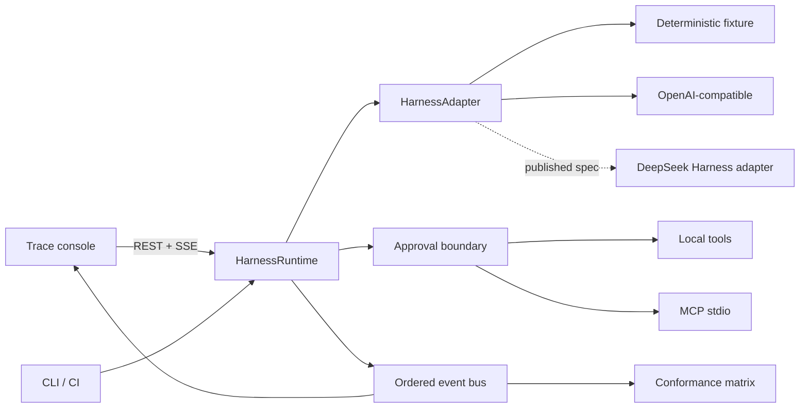

# HarnessLab

**A protocol-first conformance lab and trace console for agent harnesses.**

[](https://github.com/Linxiushen/harnesslab/actions/workflows/ci.yml)
[](https://www.python.org/)
[](LICENSE)

HarnessLab makes an agent loop observable and testable at the protocol boundary: model turns,
tool calls, policy decisions, results, and terminal states are retained as one ordered event
stream. It includes a live trace console, a deterministic offline adapter, an OpenAI-compatible
adapter, an optional MCP stdio bridge, and an executable conformance matrix.

> [!IMPORTANT]
> DeepSeek Harness has not published a protocol at the time of writing. This project does not
> claim official or preview compatibility. The discovery probe is deliberately isolated so a
> real adapter can be implemented against the first published specification without rewriting the
> runtime, UI, or tests.


## Run it

```bash
python -m venv .venv
.venv/Scripts/pip install -e ".[dev]"  # Windows
harnesslab check
harnesslab serve
```

Open [http://127.0.0.1:4318](http://127.0.0.1:4318). The reference run is deterministic and does
not need a model key or network access.

macOS and Linux:

```bash
python -m venv .venv
.venv/bin/pip install -e ".[dev]"
.venv/bin/harnesslab serve
```

Docker is also supported:

```bash
docker compose up --build
```

## What is executable today

| Surface | Status | Contract |
| --- | --- | --- |
| Agent loop | Ready | Multi-turn model/tool loop with a hard turn limit |
| Trace stream | Ready | Ordered events over SSE with correlated call IDs |
| Tool policy | Ready | Read-only auto approval; side effects fail closed |
| Conformance | Ready | Six CI-runnable protocol invariants |
| OpenAI-compatible API | Ready | Chat completions and function tools |
| DeepSeek public API | Ready | Enabled only when `DEEPSEEK_API_KEY` is set |
| MCP stdio | Optional | Official Python SDK via `pip install -e ".[mcp]"` |
| DeepSeek Harness | Adapter-ready | No speculative wire format or compatibility claim |

## Architecture



The adapter contract is intentionally small:

```python
class HarnessAdapter(Protocol):
    name: str

    async def complete(
        self,
        messages: list[Message],
        tools: list[ToolSpec],
    ) -> AdapterTurn: ...
```

Provider-specific data stops at this boundary. `HarnessRuntime` owns iteration, tool policy,
correlation, terminal states, and events, while adapters own only wire translation.

## Conformance matrix

```bash
$ harnesslab check
{
  "adapter": "demo",
  "passed": 6,
  "total": 6,
  "checks": [
    {"id": "schema-fidelity", "status": "passed"},
    {"id": "ordered-events", "status": "passed"},
    {"id": "tool-roundtrip", "status": "passed"},
    {"id": "approval-boundary", "status": "passed"},
    {"id": "terminal-state", "status": "passed"},
    {"id": "evidence-answer", "status": "passed"}
  ]
}
```

Each adapter can run the same matrix. The deterministic fixture is the reference implementation,
so failures can be distinguished from provider availability or nondeterministic model behavior.

## DeepSeek API

The current public DeepSeek API uses the same runtime path as any compatible endpoint:

```powershell
$env:DEEPSEEK_API_KEY = "..."
harnesslab serve
```

The API key is read at process start, sent only to the provider, and excluded from trace events.

For any other compatible endpoint:

```powershell
$env:HARNESSLAB_BASE_URL = "http://127.0.0.1:8000/v1"
$env:HARNESSLAB_API_KEY = "..."
$env:HARNESSLAB_MODEL = "your-model"
harnesslab serve
```

## MCP bridge

Install the optional dependency and run the included server:

```bash
pip install -e ".[mcp]"
python examples/mcp_server.py
```

`MCPStdioProvider` discovers remote tool schemas through the official SDK and namespaces them
before registration. MCP tools default to side-effecting because remote annotations are not always
present; an approval provider must explicitly relax that policy.

## First-day DeepSeek Harness integration plan

1. Freeze the published capability and message fixtures in `tests/fixtures/`.
2. Implement one `HarnessAdapter` beside `DeepSeekHarnessProbe`.
3. Map native lifecycle events to HarnessLab's stable event vocabulary.
4. Run the same conformance matrix locally and in CI.
5. Add protocol-specific checks without weakening the generic six.
6. Ship an adapter extra instead of coupling the runtime to a private preview dependency.

This sequence keeps every compatibility claim tied to an executable fixture.

## API

| Method | Path | Purpose |
| --- | --- | --- |
| `GET` | `/api/meta` | Adapters, tools, and protocol status |
| `POST` | `/api/runs` | Start a run |
| `GET` | `/api/runs/{id}` | Inspect a run and its retained trace |
| `GET` | `/api/runs/{id}/events` | Consume live server-sent events |
| `POST` | `/api/conformance` | Run the adapter matrix |
| `GET` | `/healthz` | Health and version |

OpenAPI is available at `/docs` while the server is running.

## Project status

HarnessLab is an early open-source implementation built for protocol review and integration work.
See [CONTRIBUTING.md](CONTRIBUTING.md) for adapter requirements and [SECURITY.md](SECURITY.md) for
the trust model.

MIT licensed.

