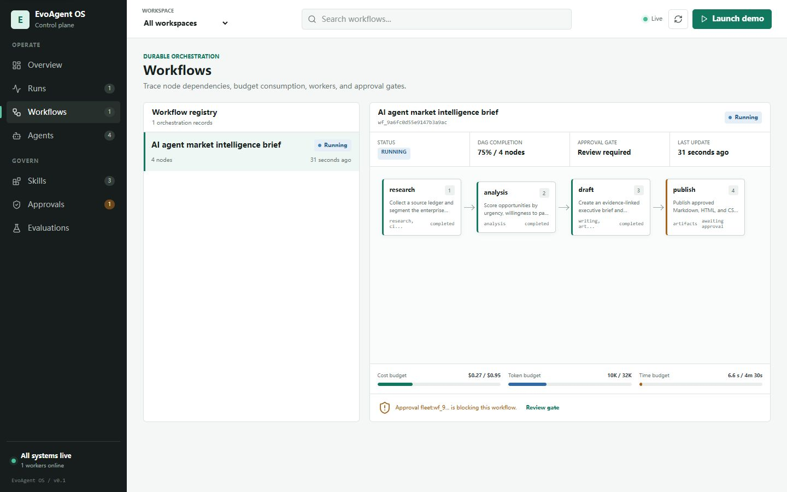

# EvoAgent OS

[](https://github.com/Linxiushen/evoagent-os/actions/workflows/ci.yml)
[](https://github.com/Linxiushen/evoagent-os/actions/workflows/codeql.yml)
[](LICENSE)
[](docs/ROADMAP.md)

**面向持久化、可治理 Agent 团队的本地优先控制平面。**

[English](README.md) | [架构](docs/ARCHITECTURE.md) | [安全](docs/SECURITY.md) | [90 秒演示](docs/DEMO_SCRIPT_90S.md) | [功能证据](docs/FEATURE_MATRIX.md)

EvoAgent OS 将五套可独立测试的 Agent 系统整合到一个仓库：持久化运行时、基于租约的 DAG 编排器、带签名的 Skill 供应链、可执行的 Trace Contract 回归测试，以及以授权为前提的实时语音和数字人网关。v0.1 控制平面在一个本地操作界面中组合 Runtime、Fleet 和 Forge，并支持不依赖模型密钥的离线演示；HarnessLab 与 EchoWeave 仍保持独立部署。

> [!IMPORTANT]
> **v0.1 是开发预览版。** 组件测试和离线路径已经可运行，但项目尚未建立多节点生产 SLO、企业身份联邦，也不声称与大型协同办公套件功能对等。部署或对外比较前，请先查看[功能范围与证据](docs/FEATURE_MATRIX.md)。



## 为什么做这个项目

能调用工具的 Agent 很容易演示，却很难长期运营。真实工作需要明确的状态迁移、受预算约束的执行、敏感操作前的人类审批、可复用 Skill 的来源证明，以及行为漂移时能够让 CI 失败的 Trace。EvoAgent OS 将这些问题定义为控制平面的核心契约。

```text
请求 -> 持久化 Run / Workflow -> 能力匹配 Worker -> 审批门禁
     -> 内容寻址工件 -> Trace Contract -> 回归判定
```

## v0.1 已实现能力

| 模块 | 已实现范围 | 代码证据 |
| --- | --- | --- |
| Runtime | 持久会话、记忆、调度、类型化工具、审批后恢复、事件账本、Prompt 候选与显式晋升 | [`services/runtime`](services/runtime) |
| Fleet | DAG 校验、能力匹配、租约与心跳、重试、预算、审批节点、SHA-256 工件、路由指标 | [`services/fleet`](services/fleet) |
| Forge | Skill 清单、静态扫描、确定性 `.evoskill` 打包、Ed25519 签名、不可变版本与评测门禁 | [`services/forge`](services/forge) |
| Observability | `harnesslab.trace/v1`、生命周期/工具/策略不变量、稳定指纹、结构化 diff 与 CI 退出码 | [`services/observability`](services/observability) |
| Realtime | 版本化 WebSocket 协议、VAD、打断、有界队列、适配器隔离、授权记录与合成媒体标识 | [`services/realtime`](services/realtime) |
| Operations | Workspace/Agent 目录、集成的 Runtime/Fleet/Forge 状态、幂等演示启动和统一本地控制台 | [`apps/control-plane`](apps/control-plane) |
| Contracts 与 SDK | 版本化 Pydantic 契约、类型化 Python SDK 和零运行时依赖的 TypeScript SDK | [`packages/contracts`](packages/contracts)、[`sdk`](sdk) |

以上是仓库内的服务边界，不代表所有能力都已经通过一个稳定公共 API 统一暴露。v0.1 期间，各服务契约仍独立演进。

## 快速开始

### Docker Compose

前置条件：Docker Engine 与 Compose v2。默认演示路径不需要 GPU，也不需要外部模型密钥。

```powershell
Copy-Item deploy/.env.example deploy/.env
# 启动前请将三个 CHANGE_ME 值分别替换为独立的随机令牌。
docker compose --env-file deploy/.env -f deploy/compose.demo.yml up --build
```

默认只监听宿主机 loopback。核心 profile 启动控制平面和 HarnessLab；独立组件与实时服务通过可选 profile 启动。

| 地址 | 服务 | Profile |
| --- | --- | --- |
| `http://127.0.0.1:8800` | 统一控制平面 | core |
| `http://127.0.0.1:4318` | HarnessLab Workbench | core |
| `http://127.0.0.1:8811` | 独立 Runtime 控制台与 OpenAPI | `components` |
| `http://127.0.0.1:8833` | 独立 Fleet 控制台与 Worker API | `components` |
| `http://127.0.0.1:8822` | 独立 Forge Registry | `components` |
| `http://127.0.0.1:8765` | EchoWeave 虚构角色实时演示 | `realtime` |

将任何端口暴露到 localhost 之外前，必须先阅读 [`deploy/README.md`](deploy/README.md)。

### 运行集成的确定性演示

使用 Python 3.11 或 3.12：

```powershell
python -m venv .venv
.\.venv\Scripts\Activate.ps1
python -m pip install -e ".[dev]"
$env:EVOAGENT_OS_TOKEN = python -c "import secrets; print(secrets.token_urlsafe(32))"
evoagent-os --port 8800
```

在另一个终端设置本地控制平面令牌，并启动仓库内的离线市场研究场景：

```powershell
$env:EVOAGENT_OS_TOKEN = "<your-local-token>"
.\examples\market-research\launch.ps1
```

集成的参考 Worker 会完成确定性的研究/复核 fixture，并在 `publish` 节点等待人工决定。这些 fixture 证明的是编排契约，而不是市场研究质量。目录中同时提供独立 Fleet 请求和 Worker 演练，详见 [`examples/market-research`](examples/market-research)。

## 开发与验证

每个 Python 组件独立管理依赖和测试。CI 会在 Python 3.11 与 3.12 上对所有列出的组件执行 Ruff 和 pytest。

```powershell
python -m pip install -e "services/runtime[dev]"
ruff check services/runtime
ruff format --check services/runtime
pytest -q services/runtime/tests
```

TypeScript SDK 需要 Node.js 20 与 pnpm：

```powershell
Set-Location sdk/typescript
pnpm install --frozen-lockfile
pnpm test
```

完整矩阵还包括控制平面、contracts、Python 与 TypeScript SDK、`fleet`、`forge`、`observability` 与 `realtime`。

## 文档

- [系统架构与信任边界](docs/ARCHITECTURE.md)
- [威胁模型](docs/THREAT_MODEL.md)
- [安全策略与漏洞披露](docs/SECURITY.md)
- [运维、备份、恢复和 SLO 指南](docs/OPERATIONS.md)
- [功能矩阵与成熟度证据](docs/FEATURE_MATRIX.md)
- [与 Magic 的中性 Clean-room 对比](docs/CLEAN_ROOM_COMPARISON.md)
- [路线图](docs/ROADMAP.md)
- [架构决策记录](docs/adr/README.md)
- [Press Kit](docs/PRESS_KIT.md)

## 许可证与来源

仓库级新增工作采用 Apache License 2.0。整合组件保留原始版权和许可声明；`services/observability`（HarnessLab）仍为 MIT License。第三方模型与素材遵循各自条款。软件许可证不授予任何自然人的声音、面部或身份使用权。

安全问题请按[私密披露流程](docs/SECURITY.md)报告；普通改进请提交范围清晰的 Issue 或 Pull Request。
