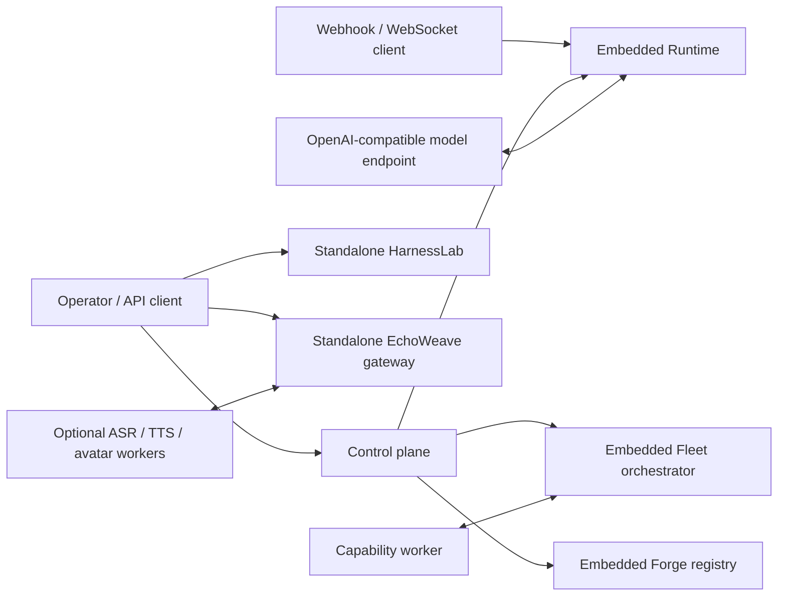
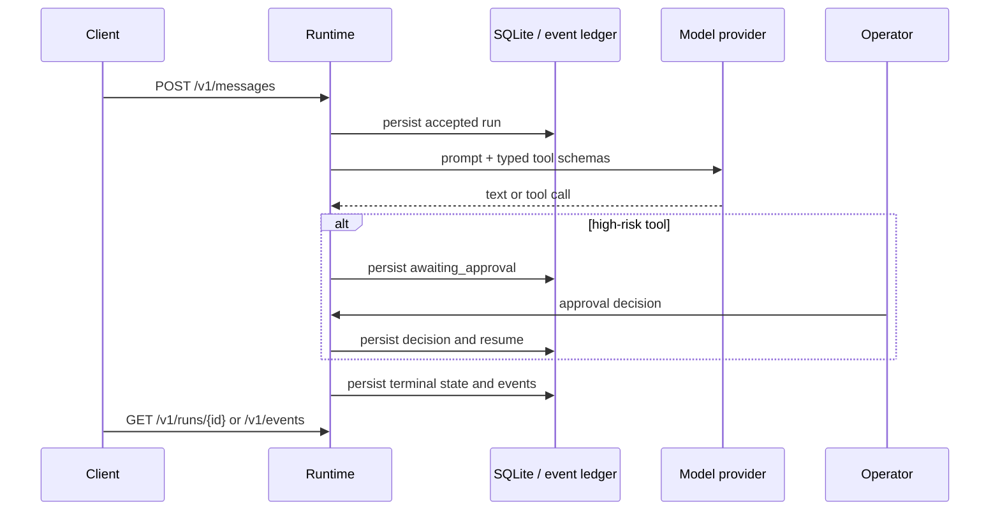
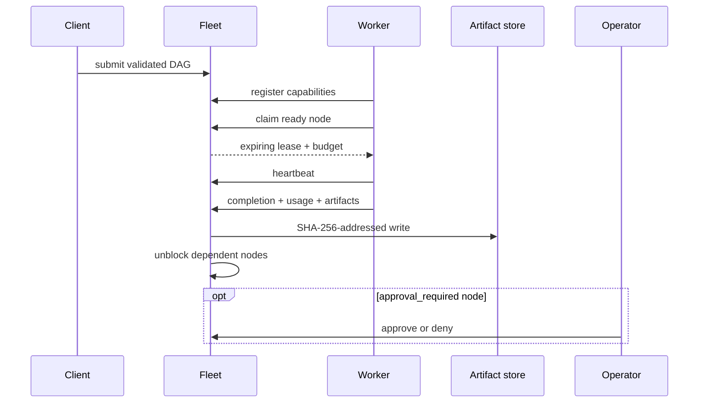

# Architecture

Status: v0.1 development preview  
Last reviewed: 2026-08-10

EvoAgent OS is a monorepo of independently runnable control-plane services. The design favors explicit contracts and local deterministic paths over a single hidden agent loop. Components can be used separately; the v0.1 development control plane composes Runtime, Fleet and Forge in one local process, while HarnessLab and EchoWeave remain external services with their own boundaries.

## System context



All public ports in the reference Compose file bind to `127.0.0.1`. Authentication, TLS termination, tenant isolation and network policy are deployment responsibilities described in [Security](SECURITY.md).

## Component boundaries

| Component | Owns | Persistent state | Does not own |
| --- | --- | --- | --- |
| Runtime | Sessions, messages, runs, memory, approvals, schedules, prompt versions, runtime events | SQLite WAL and workspace files | Multi-worker DAG scheduling |
| Fleet | Workflow DAGs, nodes, workers, leases, budgets, artifacts, route observations, fleet events | SQLite WAL and artifact directory | Model prompts or skill signing |
| Forge | Skill validation, scanning, packaging, signatures and release metadata | Registry SQLite/files, signing keys supplied externally | Runtime sandboxing or trust decisions for operators |
| HarnessLab | Agent trace capture, projection, fingerprints, diffs and conformance reports | In-process/reference run records and exported trace artifacts | Full telemetry backend or raw secret retention |
| EchoWeave | Realtime session protocol, media pipeline, interruption, consent checks and adapter boundaries | Consent/persona configuration and optional runtime state | General DAG orchestration |
| Control plane | Workspaces, agent catalog, correlation/idempotency records and an integrated local Runtime/Fleet/Forge experience | Control, runtime and Fleet SQLite files plus workspace/artifact/registry directories under one state root | HarnessLab trace storage or EchoWeave media sessions |
| Contracts/SDKs | Versioned wire models and typed Python/TypeScript client calls | No authoritative state | Service execution or policy decisions |

## Primary flows

### Durable runtime request



The database record is authoritative. A high-risk tool does not execute before an approval decision. Prompt evolution creates a candidate and requires comparative evaluation plus explicit promotion; it does not mutate the active prompt during a conversation.

### Fleet workflow



The lease token is the commit capability. Fleet rejects a completion whose lease is inactive or whose declared token/dollar usage exceeds the node budget. Expired work is retried up to `max_attempts`; this is at-least-once execution, so external side effects still require idempotency keys.

### Skill supply chain

```text
SKILL.md -> validate -> static scan -> executable cases -> deterministic package
         -> Ed25519 sign -> publish immutable release -> verify digest/key/capabilities
```

A signature authenticates exact bytes to a key; it does not prove the code is safe or the signer is trustworthy. Execution must still occur with least privilege and an appropriate sandbox.

### Regression evidence

HarnessLab projects observed events into `harnesslab.trace/v1`. Volatile values such as run IDs and timestamps are excluded from the protocol fingerprint. CI can then reject lifecycle, tool path, approval path, terminal-state or invariant drift without requiring identical model prose.

## Data and consistency

- Runtime, Fleet and Forge use local SQLite-backed reference stores. SQLite WAL provides durable single-host state, not distributed consensus.
- Runtime and Fleet event records are append-oriented audit evidence but are not a tamper-proof external audit log.
- Fleet artifacts are named by SHA-256 digest under the workflow/node scope. A digest proves content identity, not author identity.
- Cross-service operations are not distributed transactions in v0.1. Callers must retain correlation IDs and reconcile partial failure.
- Realtime media adapters are isolated by interfaces and bounded queues. GPU services are optional and deployed separately because their dependency stacks and capacity profiles differ.

## Failure semantics

| Failure | v0.1 behavior | Operator action |
| --- | --- | --- |
| Runtime restart | Persisted sessions/runs remain; in-flight process work may need inspection | Check non-terminal runs and event tail |
| Fleet worker loss | Lease expires; eligible node is requeued until attempts are exhausted | Confirm downstream side effects were idempotent |
| Late Fleet completion | Rejected because the lease is no longer active | Discard result or submit it through a reviewed recovery path |
| Model endpoint unavailable | Run fails with provider evidence | Retry at the caller/workflow level after checking idempotency |
| Forge signing key unavailable | Package can be built but cannot produce a trusted signed release | Restore key through the external key-management process; never commit it |
| Trace regression | Verification exits non-zero | Review structural diff; update a baseline only after intentional review |
| Realtime adapter pressure | Bounded queue/timeout/cancellation paths limit accumulation | Shed load, inspect metrics and scale the constrained worker |

## Deployment evolution

The reference topology is intentionally single-host. A production multi-replica design should preserve the API invariants while replacing local primitives:

1. Move authoritative workflow claims to a transactional shared store or durable workflow engine.
2. Place artifacts in an object store with integrity checks and retention policy.
3. Export audit events to an append-only external sink with access controls.
4. Introduce workload identity, tenant-aware authorization and centralized secret management.
5. Run tool/skill execution in isolated workers with outbound network policy.
6. Establish capacity baselines and SLOs on the exact model/hardware combination.

Relevant decisions are recorded under [`docs/adr`](adr/README.md).
