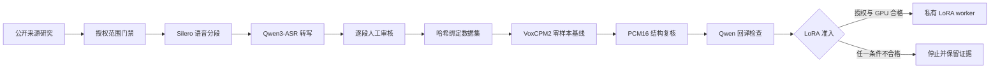

# 经授权门控的创作者数字分身实验：峰哥研究线

> **Public research only / Runtime blocked / LoRA not performed**
>
> 这是本地评测记录，不是已发布 persona，也不代表“峰哥本人在线”。公开仓库只记录流程和聚合指标；声音、视频、转写、授权附件、训练集、生成样本和模型产物全部保留在忽略的私有工作区。
>
> 指标日期：2026-08-04。证据级别：操作者本地运行记录，尚未经过独立第三方评测。

## 为什么把它写进项目

“复制一个人”很容易被写成一句演示文案，真正困难的是让每一步都可追溯、可撤回、可验证，并且在授权或硬件不满足时明确停止。这个案例把用户所称的“峰哥”解析为公开账号“峰哥亡命天涯”，再用本地候选数据检验 EchoWeave 的授权数据工作流和 VoxCPM2 训练准入。

公开人物资料和来源置信度单独记录在[研究档案](research/fengge-wangmingtianya-public-profile.md)中。研究档案本身不构成授权，也不会自动生成真人 persona。

## 当前进度

| 阶段 | 结果 | 发布边界 |
|---|---|---|
| 公开资料研究 | 已建立带来源和置信度的档案 | 仅使用公开事实，不推断私生活或隐藏记忆 |
| 授权状态 | 操作者声明已取得本地采集与训练授权 | 项目尚未独立核验身份、授权方、有效期及云处理范围 |
| 声音候选生成 | Silero 分段与 Qwen3-ASR 转写已完成 | 原始媒体、分段和转写不进入 Git |
| 人工审核 | 22 段全部逐段审核通过，共 309.42 秒 | 仅批准本地训练数据准备，不代表公开发布 |
| 可信数据集 | 已导出路径、大小和 SHA-256 绑定的数据集 | `runtime_promotion_allowed=false` |
| VoxCPM2 基线 | 已生成 5.76 秒、48 kHz、单声道 PCM16 零样本样本 | `training_performed=false`，样本不公开 |
| 结构验证 | 276,480 帧、有限且非静音、0 个满幅样本 | 只证明文件有效，不证明音色相似 |
| 内容验证 | Qwen3-ASR 回译与披露文案完全一致，归一化相似度 1.000000 | 机器自检不能替代人工听评 |
| VoxCPM2 LoRA | 未执行 | 本机 4GB Quadro P1000 不满足训练准入 |
| 真人运行时 | 未注册 | 未完成正式授权验证、音色听评和发布审批前保持关闭 |

这里的“训练研究线”包括训练前的数据工程、审计、基线和准入判断；它不把零样本推理包装成训练结果，也不声称模型代表本人观点。

## 可审计流程

流程中的审核结论、数据集、参考声音和运行产物都不依赖 GitHub 充当私有素材仓库。公开提交只保留设计、代码、模型修订和不泄露生物特征的聚合结果。

## 本次实验实际验证的内容

- **人工审核与数据绑定可追溯。** 只有逐段批准的音频进入私有数据集，导出结果再绑定审核记录、文件大小和 SHA-256；文件变更会使后续准入失败。
- **数据准备可以失败关闭。** 未经逐段人工确认的音频不能进入训练数据集；文件变更会破坏哈希绑定。
- **输出有独立模型的自动交叉检查。** WAV 写盘后重新读取并验证编码、声道、采样率、有限值、静音和削波；另用固定版本 Qwen3-ASR 检查披露文案。这不是独立第三方评测，也不是音色相似度结论。
- **硬件限制不会被隐藏。** 当前主机只能完成 CPU 零样本推理，正式 LoRA worker 要求 Linux、原生 BF16 的 Ampere 或更新 GPU、至少 24GB 总显存和 22GB 空闲显存。
- **GitHub 不是生物特征仓库。** `.gitignore` 排除 `materials/`、`runtime/` 和真人 persona；公开案例不包含可恢复的声音、脸部素材或模型 adapter。

## 框架已有但本案例尚未执行的边界

EchoWeave 已实现 VoxCPM2 和 SoulX worker 的短期、一次性 consent assertion，绑定 persona、授权 revision、scope、素材哈希和 audience。但由于本案例没有注册真人 persona，也没有进入 SoulX 或正式 VoxCPM2 运行时，这条 assertion 链路不是本次实名实验的验证结果。它必须等正式授权和发布准入完成后再单独测试。

## 下一道门

正式 LoRA 需要同时满足以下条件：

1. 将操作者声明升级为机器可验证的正式授权记录，明确身份、授权方、用途、有效期、撤回方式及处理器范围。
2. 在受控 Linux GPU 上运行 `validate`、`preflight` 和 `run`，并保存不可变运行记录。
3. 对生成结果完成人工内容、音色相似度、冒充风险和持续 AI 披露审核。
4. 只有发布审批通过后，才生成签名 persona manifest 并加入运行时 allowlist。

训练可行性和硬件证据见 [VoxCPM2 training feasibility audit](VOXCPM2_TRAINING_AUDIT.md)，完整私有流程见 [Private VoxCPM2 training workflow](VOXCPM2_PRIVATE_TRAINING.md)。
