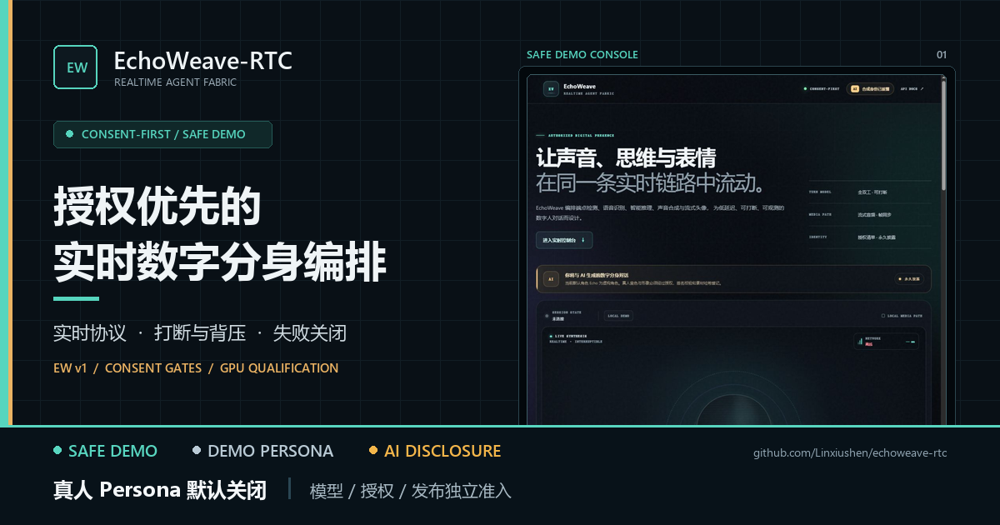

# EchoWeave-RTC Press Kit

> Version 0.2 / Evidence snapshot: 2026-08-04
>
> This kit contains public project facts and aggregate research status only. It
> does not contain private voice, face, video, transcript, authorization, model
> adapter, checkpoint, prompt, or conversation data.



## One-line positioning

**中文**

EchoWeave-RTC 是一个授权优先、失败关闭的实时语音与数字头像 Agent 编排框架，统一实时协议、打断、背压、隔离模型 worker 与可审计准入。

**English**

EchoWeave-RTC is a consent-first, fail-closed orchestration framework for real-time voice and avatar agents, unifying media transport, interruption, backpressure, isolated model workers, and auditable admission.

## Short description

EchoWeave-RTC 把端点检测、ASR、流式 LLM、TTS 和口型视频接入一条可测试的实时会话链路。它将授权范围、素材哈希、有效期、撤回和持续 AI 披露作为运行时边界，并提供无需 GPU 或 API key 的安全 demo。

EchoWeave-RTC connects endpointing, ASR, streaming LLM responses, TTS, and lip-synced video through a testable real-time session pipeline. Consent scope, asset hashes, expiry, withdrawal, and persistent AI disclosure are runtime boundaries, while the bundled safe demo requires neither a GPU nor an API key.

## Long description

EchoWeave-RTC 0.2 面向经授权数字分身、虚构角色和明确标识的合成媒体。自研 EW v1 WebSocket 协议在同一连接中承载 JSON 控制、PCM 音频和 MP4 分片，并提供版本与能力协商、单调事件序号、固定错误分类及有限消息尺寸。会话状态机通过 generation epoch 处理语音打断，在每个输出边界丢弃旧 generation 的结果；语音短句、出站消息、字节数、并发和阶段耗时均设有上限。

第三方模型通过隔离适配器和独立 worker 接入，而不是被重新包装成自研模型。真人 persona 必须经过独立的授权、素材、会话和发布准入：配置绑定授权 revision、scope、有效期和素材 SHA-256；会话使用短期一次性 token；VoxCPM2 与 SoulX 请求使用防重放 consent assertion。授权、完整性或披露条件不满足时，系统失败关闭。

仓库同时提供安全 demo、结构化指标、并发基准与故障注入工具，以及固定模型和源码 revision 的 GPU qualification pack。后者校验私有输入哈希、授权记录、CUDA/GPU 条件、源码状态和输出绑定，并生成受 HMAC 保护的运行记录。它是资格审查工作流，不是任意硬件上的性能或训练成功承诺。

## Verified talking points

| 可公开表述 | 现有证据 | 必须保留的边界 |
|---|---|---|
| 自研 EW v1 实时控制与二进制媒体协议 | `docs/PROTOCOL.md`、`src/echoweave/protocol.py` | 当前媒体边缘是 WebSocket PCM/MP4，不等同于 WebRTC |
| 支持 generation epoch 打断、陈旧输出隔离和有界背压 | `docs/ARCHITECTURE.md`、会话与前端生命周期测试 | 非抢占 GPU kernel 可能在后台完成，但旧结果不能重新进入播放 generation |
| 真人 persona 采用签名授权、素材哈希、有效期、撤回和一次性会话门禁 | `docs/SECURITY.md`、persona/session/worker authorization tests | 软件不能自行证明授权文件真实或满足所有司法辖区要求 |
| Silero、Qwen、DeepSeek、VoxCPM2、Nuwa 和 SoulX 通过明确边界接入 | `README.md`、`docs/MODELS.md`、worker 与 adapter 模块 | 这些模型是固定来源的第三方组件；不能称为全部自研或声称已完整真实联调 |
| GPU qualification pack 固定上游版本并失败关闭 | `gpu_worker_pack/README.md`、`src/echoweave/gpu_worker.py` | qualification 不是生产发布，零样本推理不是 LoRA 训练 |
| 提供连接、首 token、文本完成和整轮 p50/p95/p99 以及故障注入 | `scripts/benchmark_realtime.py`、`docs/OPERATIONS.md` | 已保存结果来自本地安全 demo；不能作为真实模型或生产性能承诺 |
| 默认 demo 不需要 GPU、API key 或真人生物特征 | `README.md`、`personas/example/` | demo 只能证明协议、状态机和 UI 路径，不证明真实模型质量 |
| AI 身份披露属于会话准入和媒体输出边界 | `docs/PROTOCOL.md`、`docs/SECURITY.md` | 水印不是 C2PA，也不能替代授权、来源记录或发布审核 |

## Fengge research track

“峰哥研究轨道”是一个公开的授权门控数字分身工作流案例，不是已发布 persona，也不是“本人在线”演示。公开仓库只保留流程、源码版本和不可恢复个人生物特征的聚合指标。

截至 2026-08-04，公开证据支持以下准确表述：

- 已建立 12 个公开来源的分级研究记录，并将待核验线索排除在运行时事实之外。
- 22 段、309.42 秒音频完成逐段人工检查，并导出路径、大小和 SHA-256 绑定的私有数据集。
- 私有 VoxCPM2 零样本基线完成 PCM16 文件结构检查和固定 Qwen3-ASR 内容回译检查。
- 零样本运行是推理，`training_performed=false`；没有执行 VoxCPM2 LoRA。
- 没有完成独立音色相似度、面部身份、SoulX 实名输出或第三方人工评测。
- 正式授权的身份、授权方、有效期和第三方处理范围仍待独立核验。
- 真人运行时和公开发布保持关闭；声音、视频、转写、训练集和生成样本均未进入 Git。

推荐公开表述：

> 峰哥研究轨道已完成公开资料分级、309.42 秒语音逐段审核、哈希绑定数据集和私有零样本基线检查；LoRA、音色相似度评测及真人运行时发布均未完成。

完整的公开实验边界见 [`FENGGE_DIGITAL_TWIN_LAB.md`](FENGGE_DIGITAL_TWIN_LAB.md)。不要在新闻稿、演示视频或社交帖中加入私有素材、转写文本、授权附件路径或可恢复的声音与面部信息。

## Claims that are prohibited

以下说法不受现有证据支持，禁止用于标题、截图说明、发布帖或销售材料：

- “峰哥已经复制完成”“峰哥本人在线”或“真人 persona 已上线”。
- “VoxCPM2 已训练完成”“LoRA 成功”或把零样本推理称为训练。
- “音色高度相似”“表情和口型还原本人”或任何未经独立评测的身份相似度结论。
- “授权已经独立验证”“确定合法合规”或暗示公开素材天然允许克隆。
- “六个模型全部自研”或“六模型真实端到端已经在当前机器完整跑通”。
- “毫秒级真实模型响应”“100% 稳定”“生产级吞吐”或引用 demo 基准作为生产性能。
- “互联网级 WebRTC 视频通话”；当前媒体边缘不提供 WebRTC 等价的拥塞控制、抖动缓冲、TURN 或 NAT 穿透。
- “完全防冒充”“无法篡改”“绝对安全”；内置授权状态和 replay cache 仍有明确的单进程部署边界。
- “Nuwa 蒸馏了本人的思想、记忆或真实意图”；Nuwa 只生成需人工复核的离线 persona 草稿。
- “4 GB GPU 可以训练 VoxCPM2 LoRA 或运行完整本地模型链路”。

## Launch post copy

### 中文

发布 EchoWeave-RTC 0.2：一个授权优先、失败关闭的实时语音与数字头像 Agent 编排框架。

自研 EW v1 协议把控制事件、PCM 音频和视频分片带进同一条可测试会话；generation epoch 负责打断与陈旧输出隔离，有界队列和阶段 deadline 控制背压与故障扩散。真人 persona 只有在授权范围、素材哈希、有效期、会话凭据和发布门禁满足后才能进入运行时。

仓库包含无需 GPU 或 API key 的安全 demo、基准与故障注入工具，以及固定上游版本的 GPU qualification pack。峰哥研究轨道公开的是一条可审计、条件不满足就停止的研究流程，不是“克隆完成”结论。

项目地址：https://github.com/Linxiushen/echoweave-rtc

### English

Introducing EchoWeave-RTC 0.2, a consent-first, fail-closed orchestration framework for real-time voice and avatar agents.

Its EW v1 protocol carries control events, PCM audio, and video fragments through one testable session. Generation epochs isolate stale output during interruption, while bounded queues and stage deadlines contain backpressure and dependency failures. A real-person persona cannot enter the runtime until consent scope, asset hashes, expiry, session credentials, and release gates are satisfied.

The repository includes a GPU- and API-key-free safe demo, benchmark and fault-injection tooling, and a pinned GPU qualification pack. The public Fengge research track documents an auditable workflow that stops when admission conditions fail; it is not a claim that a person has been cloned.

Project: https://github.com/Linxiushen/echoweave-rtc

## Asset index

| Asset | Dimensions | Intended use | Notes |
|---|---:|---|---|
| [`assets/echoweave-social-card.png`](assets/echoweave-social-card.png) | 1200 x 630 | GitHub social preview, release post, link card | Contains only verified framework positioning and the safe demo screenshot |
| [`assets/echoweave-console.jpg`](assets/echoweave-console.jpg) | 1065 x 907 | Product UI screenshot | Safe demo UI; not a real-person session or model-quality result |
| [`FENGGE_DIGITAL_TWIN_LAB.md`](FENGGE_DIGITAL_TWIN_LAB.md) | document | Public case-study reference | Aggregate status only; runtime blocked and LoRA not performed |
| [`PROTOCOL.md`](PROTOCOL.md) | document | Protocol reference | Canonical source for EW v1 transport claims |
| [`SECURITY.md`](SECURITY.md) | document | Consent and safety reference | Canonical source for authorization boundaries and operator duties |

Suggested alt text for the social card:

> EchoWeave-RTC social card showing the safe demo console beside the words “授权优先的实时数字分身编排”, with realtime protocol, interruption, backpressure, and fail-closed qualification highlighted.

Do not crop away the `SAFE DEMO`, `DEMO PERSONA`, or `AI DISCLOSURE` context labels. Do not combine these assets with a real person's face, voice, or name in a way that implies a released persona or endorsement.

## Social card generation

`assets/echoweave-social-card.png` was generated locally with Pillow 12.3.0 from `assets/echoweave-console.jpg`. The fixed 1200 x 630 RGB composition uses Microsoft YaHei and Segoe UI fonts, Lanczos resampling, a high-contrast safety band, PNG compression level 9, no random values, no network resources, and no embedded metadata. Repeating the same composition with the same Pillow and font binaries produces the same pixels.

Current SHA-256 values:

```text
88698a5e40a24f15dd0f68c90f70979a394b8b9f9c03437b04662f5a6710c8f7  echoweave-console.jpg
fc128d1082c636c03545dac4f24da2017d0ff61d90539da1da84300dbfb39dc0  echoweave-social-card.png
```
