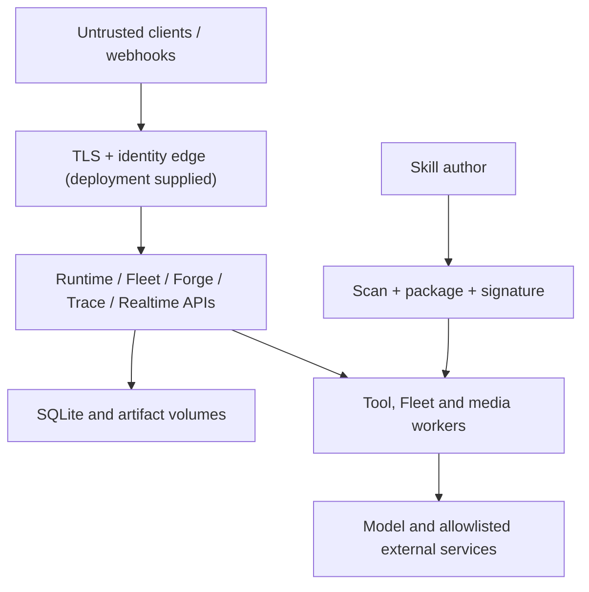

# Threat Model

Status: v0.1 development preview  
Method: asset and trust-boundary review informed by STRIDE  
Last reviewed: 2026-08-10

## Scope

This model covers the code and reference deployment in this repository. It does not claim that an arbitrary reverse proxy, model provider, GPU worker, plugin, MCP server, identity provider or host operating system is secure.

## Protected assets

- Model and channel credentials
- Operator files and Fleet artifacts
- Conversation, memory, feedback and prompt provenance
- Workflow budgets, approval decisions and lease integrity
- Skill artifacts, signing keys and trusted-key configuration
- Trace evidence and audit events
- Persona consent records, voice/face references and synthetic-media disclosure
- Availability of the control plane and workers

## Actors

| Actor | Assumption |
| --- | --- |
| Operator | Authenticated by the deployment boundary and authorized for the requested action |
| API or channel client | Untrusted until its bearer token or channel HMAC is verified |
| Model | Untrusted text and tool-call producer; may be prompt-injected |
| Fleet worker | Authenticated only by deployment policy in v0.1; its output and accounting may be dishonest |
| Skill author/signing key | Identity must be established out of band; signatures alone do not establish trust |
| Realtime persona subject | Must have explicit, current, scoped consent |
| External service | Untrusted network dependency with independent availability and data policies |

## Trust boundaries

The reference Compose stack only supplies a localhost boundary. Fleet, Forge and HarnessLab do not provide a complete enterprise authorization layer. Runtime authentication is optional when no gateway token is configured. Those facts make public exposure unsafe without an authenticated edge.

## Threats and controls

| Threat | Implemented control | Residual risk / required deployment control |
| --- | --- | --- |
| Prompt injection causes a side effect | Runtime tool risk classification and approval before high-risk execution | Tool classifications can be wrong; isolate execution and require review for irreversible actions |
| Workspace path traversal | Resolved-path containment and bounded file operations in Runtime | Same-process tools are not a hostile-code sandbox |
| Server-side request forgery | Runtime HTTPS-only allowlist, address checks, no redirects and output bounds | DNS rebinding and allowlisted service compromise remain possible; enforce egress policy |
| Unauthorized gateway request | Optional Runtime bearer token, webhook HMAC; Realtime token/session controls | Reference Fleet/Forge/Trace APIs need an authenticated reverse proxy |
| Worker steals or replays work | Expiring Fleet lease token and active-lease check | v0.1 worker registration is not workload identity; protect APIs and rotate credentials externally |
| Duplicate side effect after retry | Expired leases reject late commit | Worker may have performed the external action before failure; require downstream idempotency keys |
| Budget bypass | Fleet validates declared completion usage against node budget | Worker self-reports usage; production metering must be trusted and enforced upstream |
| Malicious Skill | Declared capabilities, static scanner, deterministic bytes, signature and evaluation gate | Scanner cannot prove safety; execute in a sandbox without ambient secrets |
| Artifact substitution | SHA-256 content address; optional Ed25519 signature for skills | Trusted key distribution and revocation are out of band in v0.1 |
| Trace leaks credentials | Recursive key/pattern redaction before publication | Novel secret formats and sensitive business text can remain; minimize trace payloads and control access |
| Audit record tampering | Durable event records with stable IDs/order | Local DB administrators can alter state; export to protected append-only storage for stronger assurance |
| Persona impersonation | Consent manifest, subject/capability scope, expiry/revocation checks, persistent AI disclosure | Legal authorization and identity proofing remain operator responsibilities |
| Denial of service | Input limits, bounded queues, timeouts, lease expiry and concurrency settings | No global tenant quota or distributed rate limiter in v0.1 |
| Dependency compromise | Dependabot, CodeQL, pinned EchoWeave build constraints and CI | Not every transitive package/image is locked repository-wide; generate SBOMs and sign release images |

## Security invariants

The following invariants should remain executable tests or deployment gates:

1. A high-risk Runtime tool cannot complete before an approval event.
2. A denied tool cannot later emit a successful completion for that request.
3. A Fleet node cannot commit after its lease expires or under a different worker/token pair.
4. Completion exceeding the declared token or dollar budget is rejected.
5. A packaged Skill with high/critical scanner findings is blocked.
6. A signature is checked against exact artifact bytes and an explicitly trusted key.
7. Trace exports redact recognized secret fields before SSE or artifact publication.
8. A real-person Realtime session requires current scoped consent and visible synthetic-media disclosure.

## Explicitly out of scope for v0.1

- Formal verification or a certified compliance posture
- Byzantine workers or a hostile database administrator
- Multi-tenant authorization and row-level isolation
- Hardware-backed signing-key custody
- A complete malware sandbox for arbitrary skills/tools
- Guaranteed deletion from third-party model providers
- Rights clearance for user-supplied media or personas

## Review triggers

Update this model when a service becomes internet-facing, a new tool executor or model provider is added, tenant identity is introduced, the event schema changes, skill installation becomes automatic, or real-person media handling changes.
