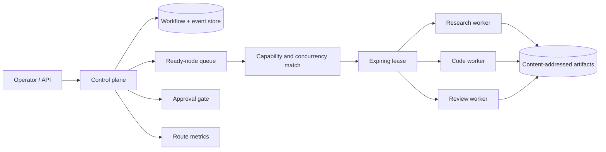

# Architecture

The workflow database is authoritative. A node becomes ready only after all dependencies complete. Claim uses a conditional update, making the lease token the commit capability. Heartbeats extend that lease; completion, failure and late-result rejection are durable transitions.

The local reference uses SQLite WAL. A multi-replica deployment should move claims to PostgreSQL `FOR UPDATE SKIP LOCKED` or a durable workflow engine while preserving the API invariants.

