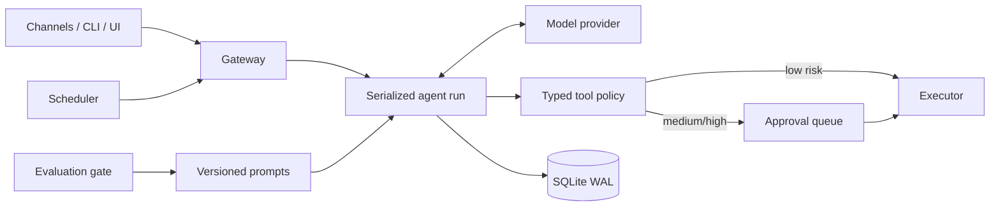

# Architecture

The Gateway owns ingress and authentication. `AgentRuntime` creates stable channel/peer sessions, snapshots the active prompt version, and persists transitions before executing work. Tool policy is evaluated before every call. Approval stores the exact tool name and arguments, then resumes the original run after a decision.

SQLite is the durable event source for this single-node reference implementation. WAL mode and a process lock make concurrent HTTP tasks safe; a clustered deployment should replace `Store` with a transactional database and claim-based run queue.

Prompt evolution is intentionally outside the live loop. `EvolutionEngine` proposes an immutable candidate from feedback, evaluates baseline and candidate on the same scenarios, applies a safety invariant, and creates a new active version only after explicit promotion.

Extension points are `Provider`, `ToolRegistry`, channel webhooks and the Store boundary. The HTTP and WebSocket contracts make remote adapters possible without importing runtime internals.

